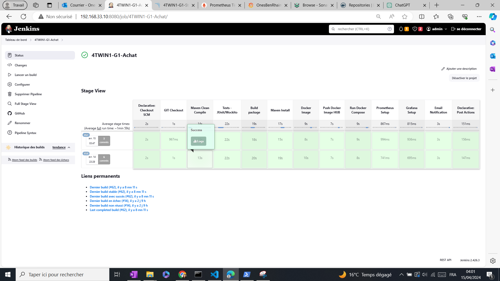

"# 4TWIN1-G1-Backend-Achat"

# DevOps Project ACHAT : Stock

## Overview

Welcome to the DevOps Project Management repository! This project aims to streamline the deployment process using various DevOps tools and practices. Below are the key steps I followed to ensure successful deployment.

## Key Steps

1. **Environment Setup with Jenkins**: Prepared the Jenkins environment and successfully retrieved Spring Boot projects while determining the necessary Maven and JDK versions.

2. **Configuration and Preparation**: Ensured a clean project build, crucial for deployment reliability.

3. **Backend Services Testing with JUnit and Mockito**: Conducted rigorous testing using JUnit and Mockito to ensure the reliability and functionality of backend services.

4. **Source Code Quality Check with SonarQube **: Utilized SonarQube to maintain high code quality standards, ensuring the robustness of the solution.

5. **Artifact Creation and Hosting in Nexus**: Used Nexus to store and manage artifacts, ensuring efficient dependency management and consistent distribution.

6. **Publishing Images on DockerHub**: Published created images on DockerHub for easy and fast availability.

7. **Start of Images**: Started the image containing the Spring deliverable using docker-compose.

8. **Monitoring and Data Visualization with Prometheus and Grafana**: Configured Prometheus and Grafana to monitor performance in real-time, including dashboards for Jenkins performance and Spring Boot application system monitoring.

9. **Email Notification and Execution Reports**: Automatically triggered email notification after pipeline execution, providing detailed execution reports.

## Skills Utilized

- Jenkins
- SonarQube
- Nexus
- JUnit
- Grafana
- Prometheus
- Docker
- DevOps

## Key Steps with Imges

